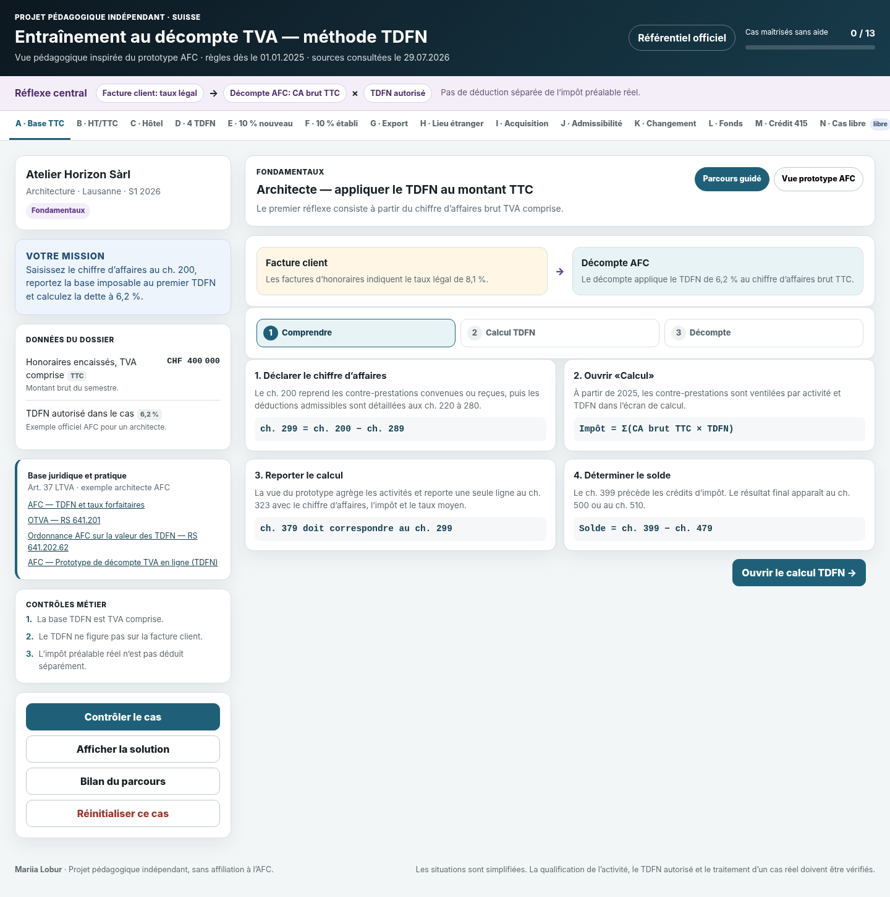
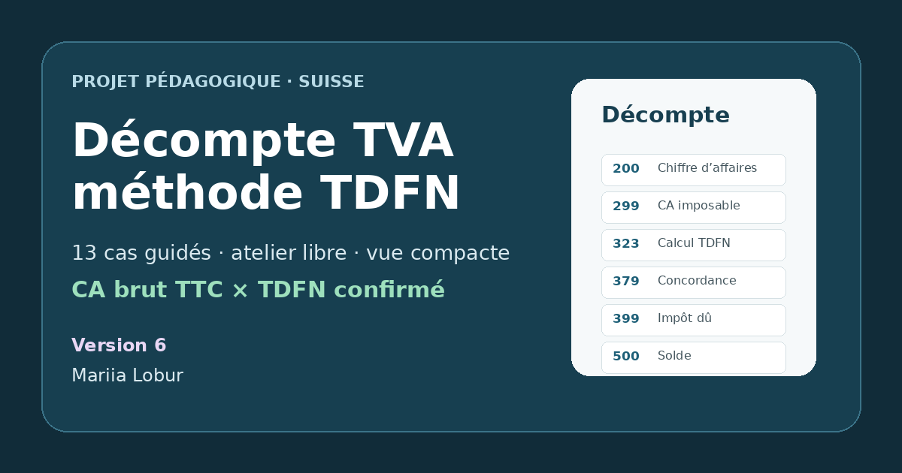
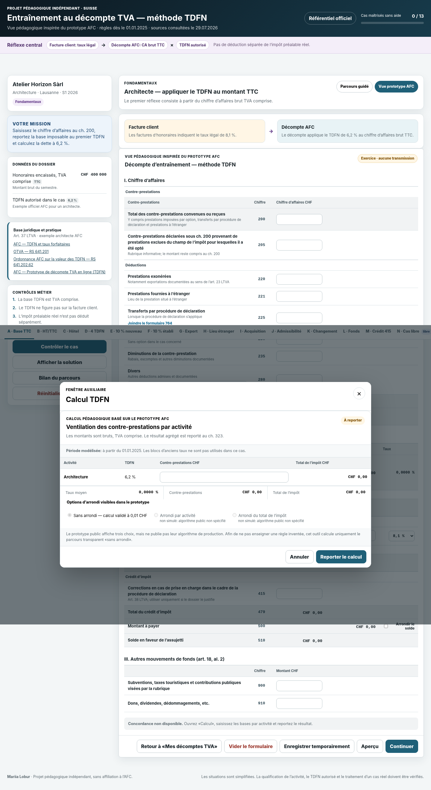
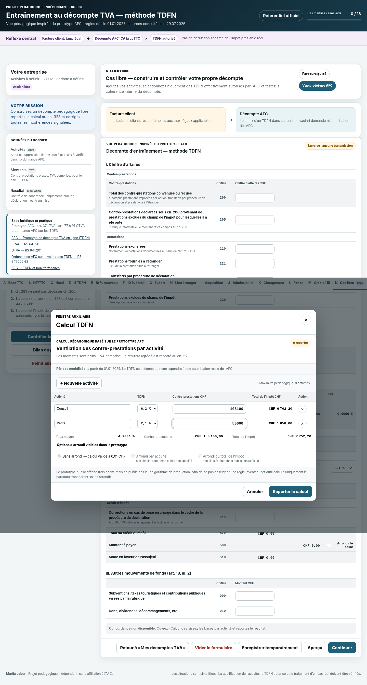
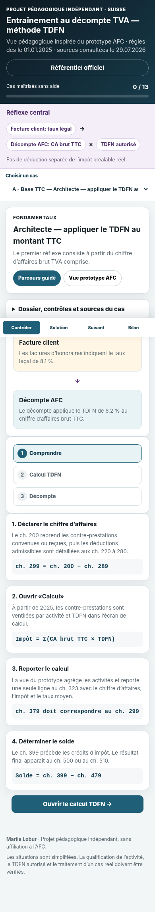

<div align="center">

# 🇨🇭 TVA suisse — méthode TDFN

### Entraînement pratique à la méthode des taux de la dette fiscale nette

Un parcours interactif, gratuit et en français pour **comprendre, calculer et pratiquer la TVA suisse selon la méthode TDFN** à partir de situations proches du travail réel en fiduciaire.

[](https://mariialobur.github.io/tva-tdfn/)
[](https://mariialobur.github.io/tva-tdfn/)
[](https://mariialobur.github.io/tva-tdfn/)
[](https://mariialobur.github.io/tva-tdfn/)
[](https://mariialobur.github.io/tva-tdfn/)

### 👉 [Ouvrir l’entraînement TDFN](https://mariialobur.github.io/tva-tdfn/)

</div>

<p align="center">
  
</p>

> [!IMPORTANT]
> Ce projet est un **outil pédagogique indépendant**. Il n’est ni un service de l’Administration fédérale des contributions (AFC/ESTV), ni une formation accréditée, ni un conseil fiscal individualisé. Les textes légaux, publications et services officiels en vigueur restent déterminants.

---

## Pourquoi ce projet ?

La méthode TDFN paraît relativement simple lorsqu’elle est résumée à une formule : chiffre d’affaires brut, TVA comprise, multiplié par un taux. En pratique, les difficultés commencent souvent **avant le calcul** : quelle opération faut-il qualifier ? Quel montant doit être reporté ? Plusieurs activités doivent-elles être séparées ? Quel TDFN utiliser ? Comment traiter une acquisition de prestations à l’étranger, une correction ou un changement de méthode ?

L’objectif de cet entraînement est de travailler ces réflexes dans un environnement où l’erreur est permise. Chaque dossier invite à **analyser la situation, effectuer le calcul puis reconstruire le décompte**, avec une correction pédagogique et les références officielles utiles.

Le projet s’adresse notamment aux personnes qui souhaitent consolider leur pratique de la TVA suisse : comptables, collaborateurs de fiduciaire, personnes en formation, indépendants ou professionnels souhaitant réviser la méthode TDFN à travers des situations concrètes.

---

## En un coup d’œil

| Parcours              | Contenu                                                                              |
| --------------------- | ------------------------------------------------------------------------------------ |
| **44 cas**            | 43 étapes évaluées + 1 atelier libre                                                 |
| **Progression**       | suivi `Acquis` / `Maîtrisé`, enregistré localement                                   |
| **Cas pratiques**     | PME, fiduciaire, commerce, services, hôtellerie, garage, opérations internationales… |
| **Méthode**           | analyser → calculer → reporter au décompte                                           |
| **Références**        | LTVA, OTVA, publications AFC et rubriques du décompte                                |
| **Évaluation finale** | 12 questions aléatoires, débloquées après validation des 43 étapes sans assistance |
| **Attestation**       | document en 2 pages : résultat + relevé détaillé des thèmes abordés                  |
| **Accès**             | gratuit, sans inscription                                                            |

---

## ✨ Ce que l’entraînement permet de travailler

### `1` Comprendre la logique TDFN

Le parcours commence par les mécanismes qui provoquent le plus d’erreurs : distinction entre **taux légal facturé au client** et **TDFN utilisé dans le décompte**, base de calcul TTC, dette fiscale calculée sur les contre-prestations et traitement forfaitaire de l’impôt préalable.

Les premiers cas servent à installer les bons automatismes avant de passer à des dossiers plus complexes.

### `2` Travailler plusieurs activités et plusieurs TDFN

Une entreprise réelle n’exerce pas toujours une seule activité. Le parcours propose notamment des situations de commerce, location, atelier, garage automobile, hôtellerie ou prestations de services avec plusieurs flux à ventiler.

L’objectif n’est pas uniquement d’obtenir le bon total, mais de comprendre **pourquoi une activité doit être identifiée séparément**, comment contrôler la cohérence de la ventilation et comment éviter de transformer un taux moyen en TDFN fictif.

### `3` Aller au-delà du simple calcul

Les exercices abordent progressivement plusieurs sujets de pratique courante :

* admissibilité à la méthode TDFN et limites applicables ;
* distinction entre taux légal et TDFN ;
* calcul sur les contre-prestations TVA comprise ;
* activités multiples et règle des 10 % ;
* utilisation de plusieurs TDFN ;
* contre-prestations convenues ou reçues ;
* opérations internationales ;
* impôt sur les acquisitions ;
* déductions et rubriques du décompte ;
* rectifications ;
* concordance annuelle ;
* délais et contrôles de cohérence ;
* passage de la méthode effective aux TDFN ;
* passage des TDFN à la méthode effective ;
* corrections liées aux changements de méthode ;
* dossier fiduciaire final en plusieurs étapes.

### `4` Apprendre à lire un décompte

L’interface reprend la logique des principales rubriques utilisées dans le décompte TVA afin de relier le raisonnement fiscal au travail administratif concret.

Le participant ne reçoit pas uniquement une réponse numérique : il doit déterminer **où le montant doit apparaître, quelle base utiliser et comment les différentes rubriques se réconcilient**.

### `5` Comprendre ses erreurs

Une mauvaise réponse n’est pas traitée comme un simple « faux ».

Plusieurs cas contiennent des diagnostics ciblés capables d’identifier des erreurs typiques : base HT utilisée à la place du TTC, mauvaise rubrique, confusion entre taux légal et TDFN, ventilation incohérente ou correction mal positionnée.

Après validation, la solution et les sources permettent de reconstruire le raisonnement.

---

## 🧭 Comment fonctionne le parcours ?

Chaque dossier suit une logique volontairement répétitive afin de développer progressivement des réflexes de travail.

### Étape 1 — Analyser

Lire le dossier, qualifier les opérations, identifier les informations pertinentes et vérifier les points de vigilance.

### Étape 2 — Calculer

Construire les bases nécessaires et effectuer les calculs sans perdre de vue la différence entre facturation client et méthode de décompte.

### Étape 3 — Décompte

Reporter les montants dans les rubriques utiles, contrôler les totaux et vérifier la cohérence du résultat.

### Correction

Après validation, le parcours fournit une explication, des diagnostics lorsque cela est pertinent et les références officielles utilisées pour le cas.

---

## 📈 Progression : `Acquis` et `Maîtrisé`

Le compteur de progression ne sert pas uniquement à indiquer combien de cas ont été ouverts.

* **Acquis** : le cas a été réussi après la phase d’apprentissage.
* **Maîtrisé** : le même raisonnement a été revalidé ensuite sans s’appuyer sur l’exemple.

La progression reste enregistrée localement dans le navigateur afin de pouvoir reprendre le parcours plus tard.

Un **atelier libre** complète les cas guidés pour permettre de tester un scénario de manière plus autonome.

---

## 🧠 Évaluation finale TDFN

Une évaluation séparée apparaît à la fin du parcours afin de distinguer clairement **apprentissage** et **auto-évaluation**.

Le module final comprend :

* **12 questions** tirées aléatoirement d’une banque de questions auditée ;
* aucune aide pendant l’épreuve ;
* aucune solution visible avant la remise ;
* aucun mémo ou source accessible pendant le test ;
* ordre des réponses mélangé ;
* correction affichée uniquement après la remise ;
* seuil de réussite : **9 / 12** ;
* possibilité de refaire une nouvelle série.

L’évaluation devient accessible après avoir **acquis les 43 étapes évaluées sans consultation de la solution**.

> [!NOTE]
> Cette évaluation mesure uniquement la réussite aux questions proposées dans ce projet. Elle ne constitue pas une validation professionnelle générale des compétences en TVA.

---

## 📄 Attestation de parcours

Après réussite de l’auto-évaluation finale, une **ATTESTATION DE PARCOURS en deux pages** peut être générée directement dans le navigateur.

### Page 1 — Attestation de parcours

La première page présente :

* le nom indiqué par le participant ;
* les **43 étapes évaluées** du parcours ;
* le résultat obtenu à l’évaluation finale ;
* le pourcentage de réussite ;
* la date de l’évaluation ;
* une synthèse des principaux thèmes abordés ;
* l’adresse du projet.

Les thèmes principaux apparaissent sous forme synthétique afin que le document reste lisible :

`Fondamentaux TDFN · Activités multiples · Décompte TVA · Opérations internationales · Travail fiduciaire · Rectifications · Changements de méthode · Cas PME`

### Page 2 — Relevé du parcours

La seconde page constitue un **RELEVÉ DU PARCOURS** et décrit plus précisément les sujets travaillés pendant l’entraînement.

#### 1. Fondamentaux de la méthode TDFN

* admissibilité à la méthode et contrôle des limites applicables ;
* distinction entre taux légal facturé au client et TDFN utilisé dans le décompte ;
* calcul sur les contre-prestations brutes, TVA comprise ;
* traitement forfaitaire de l’impôt préalable dans la méthode TDFN.

#### 2. Activités multiples et attribution des TDFN

* identification et ventilation de plusieurs activités ;
* application de plusieurs TDFN ;
* contrôle de la règle des 10 % ;
* choix du TDFN selon l’activité réellement exercée ;
* réconciliation des comptes de produits avec les bases déclarées.

#### 3. Construction et lecture du décompte TVA

* report du chiffre d’affaires ;
* ventilation des bases soumises aux différents TDFN ;
* rubriques particulières du décompte ;
* déductions ;
* contrôles arithmétiques ;
* contrôles de cohérence.

#### 4. Opérations particulières et internationales

* prestations exonérées ;
* prestations fournies à l’étranger ;
* impôt sur les acquisitions ;
* opérations avec des prestataires étrangers ;
* qualification des flux avant leur traitement dans le décompte.

#### 5. Travail courant en fiduciaire

* contre-prestations convenues et reçues ;
* périodes de décompte ;
* délais ;
* acomptes et paiements ;
* contrôles de dossier ;
* préparation du décompte à partir des informations du client.

#### 6. Rectifications et concordance annuelle

* correction d’un décompte déjà remis ;
* décompte de rectification ;
* traitement des écarts ;
* concordance annuelle ;
* contrôles avant remise ou correction.

#### 7. Changements de méthode

* passage de la méthode effective à la méthode TDFN ;
* passage de la méthode TDFN à la méthode effective ;
* corrections liées à la valeur résiduelle ;
* utilisation des rubriques correspondantes du décompte.

#### 8. Mise en pratique sur des dossiers PME

* cas progressifs dans plusieurs secteurs d’activité ;
* dossiers multi-activités ;
* combinaison de plusieurs taux et plusieurs flux ;
* dossier fiduciaire final ;
* analyse, calcul et reconstruction du décompte ;
* atelier libre.

Le document peut ensuite être **imprimé ou enregistré en PDF** directement depuis le navigateur.

Le nom utilisé pour préparer l’attestation reste local au module de génération du document. Le résultat et l’identité ne sont pas vérifiables par un tiers auprès du site: aucun registre serveur des attestations n’est tenu.

> [!CAUTION]
> L’attestation confirme uniquement l’achèvement de ce parcours d’entraînement et la réussite de son auto-évaluation finale. Le relevé décrit les thèmes abordés au cours du parcours. Ces documents **ne constituent ni un diplôme, ni un titre professionnel, ni une certification reconnue ou accréditée**. L’identité du participant n’est pas vérifiée.

---

## 🖥️ Aperçus

### Parcours principal

<p align="center">
  
</p>

### Calcul et décompte

<p align="center">
  
</p>

### Atelier libre

<p align="center">
  
</p>

### Version mobile

<p align="center">
  
</p>

---

## 📚 Référentiel officiel

Le contenu pédagogique s’appuie en priorité sur les sources officielles suisses :

* **LTVA — RS 641.20** ;
* **OTVA — RS 641.201** ;
* ordonnance de l’AFC relative aux taux de la dette fiscale nette ;
* **Info TVA 12 — Taux de la dette fiscale nette** ;
* publications AFC relatives aux modifications applicables depuis 2025 ;
* informations AFC concernant les changements de méthode ;
* formulaires et rubriques officielles du décompte TVA ;
* informations AFC relatives aux rectifications ;
* concordance annuelle ;
* informations et services du Portail AFC.

Les sources utiles sont reliées directement aux cas et regroupées dans le référentiel du simulateur.

**Dernière mise à jour du projet : 16.08.2026**
**Revue des sources principales : 16.08.2026**

> [!TIP]
> Une règle, un taux ou une pratique TVA peut évoluer. En cas de divergence, la législation, les publications AFC et le service officiel en vigueur priment toujours sur le contenu du simulateur.

---

## 🔒 Données et confidentialité

Aucun compte n’est nécessaire pour utiliser le parcours.

La progression et le résultat de l’évaluation sont conservés localement dans le navigateur.

Le nom utilisé pour préparer l’attestation est saisi par le participant et utilisé localement pour générer le document.

Une réinitialisation du parcours permet d’effacer la progression locale et de recommencer.

---

## ⚠️ Limites du simulateur

Le projet a été conçu comme un **environnement d’entraînement**, pas comme un moteur de décision fiscale automatisé.

Il ne peut notamment pas :

* confirmer à la place de l’AFC le droit d’une entreprise déterminée d’utiliser la méthode TDFN ;
* garantir que le TDFN retenu correspond à l’activité réelle d’une entreprise particulière ;
* vérifier l’exhaustivité ou la valeur probante des justificatifs d’un dossier réel ;
* remplacer l’analyse d’un cas particulier par un professionnel compétent ;
* reproduire toutes les particularités ou tous les contrôles du Portail AFC ;
* garantir qu’une règle restée correcte lors de la dernière revue n’a pas été modifiée ultérieurement.

Les entreprises, montants et scénarios du parcours ont une finalité pédagogique.

---

## 🚀 Utiliser le projet

### Version en ligne

La manière la plus simple d’utiliser le parcours est de l’ouvrir directement :

### 👉 https://mariialobur.github.io/tva-tdfn/

Aucune installation et aucune inscription ne sont nécessaires.

### Lancer une copie localement

```bash
git clone https://github.com/mariialobur/tva-tdfn.git
cd tva-tdfn
python -m http.server 8000
```

Puis ouvrir :

```text
http://localhost:8000
```

Un petit serveur HTTP est préférable à l’ouverture directe de `index.html`, car l’application utilise des modules JavaScript ES.

---

## 🧩 Structure du projet

```text
tva-tdfn/
├── index.html              # interface principale
├── app.js                  # orchestration du parcours
├── data.js                 # cas, données pédagogiques et sources
├── logic.js                # logique de calcul et validations
├── pedagogy.js             # aides et logique pédagogique
├── store.js                # état et progression locale
├── components.js           # composants d’interface
├── evaluation.js           # évaluation finale + attestation
├── evaluation.css          # styles évaluation + document 2 pages
├── styles.css              # styles principaux
├── legal-basis.js          # références juridiques
└── preview-*.png           # captures utilisées dans ce README
```

---

## 🛠️ Principes du projet

Quelques choix structurants guident le développement.

**Pratique avant mémorisation.** Les cas cherchent à reproduire un raisonnement de travail plutôt qu’un questionnaire de définitions.

**Qualification avant calcul.** Une multiplication correcte ne compense pas une opération mal qualifiée.

**Sources visibles.** Les bases légales et publications AFC doivent pouvoir être retrouvées depuis le parcours.

**Erreur utile.** Lorsqu’une erreur typique peut être identifiée, l’interface essaie d’expliquer le raisonnement qui a probablement conduit au mauvais résultat.

**Progression sans compte.** L’outil doit rester simple à ouvrir, quitter puis reprendre.

**Séparation entre entraînement et évaluation.** Les solutions servent à apprendre pendant le parcours ; elles disparaissent pendant l’auto-évaluation finale.

**Attestation descriptive.** Le document final décrit le parcours suivi, son résultat et les thèmes abordés, sans prétendre attribuer un diplôme ou une qualification professionnelle.

---

## 🗺️ Suite du projet

Les prochaines évolutions pourront notamment porter sur :

* enrichissement de la banque de questions finales ;
* ajout de nouveaux cas complexes ;
* davantage de situations multi-activités ;
* amélioration continue des diagnostics d’erreurs ;
* revue périodique des sources AFC et Fedlex ;
* amélioration de l’accessibilité ;
* amélioration de l’expérience mobile ;
* développement de nouveaux parcours spécialisés autour de situations TVA concrètes.

Les suggestions de cas, signalements d’erreurs et remarques sur l’expérience utilisateur sont les bienvenus via les **Issues GitHub**.

---

## 🔗 Autre entraînement TVA

Un second parcours est consacré à la **méthode effective** :

### 👉 [TVA suisse — entraînement méthode effective](https://mariialobur.github.io/tva-debutant/)

Les deux projets sont pensés comme des outils complémentaires : comprendre le décompte TVA, pratiquer les calculs et développer les réflexes de qualification avant de travailler sur un dossier réel.

---

## 👤 Projet

**Conception : Mariia Lobur**
[LinkedIn](https://www.linkedin.com/in/mariia-lobur/)

Projet pédagogique indépendant, développé à des fins d’entraînement et de révision de la TVA suisse.

---

<div align="center">

### Tester · se tromper · comprendre · recommencer

**[Ouvrir l’entraînement TDFN](https://mariialobur.github.io/tva-tdfn/)**

</div>
