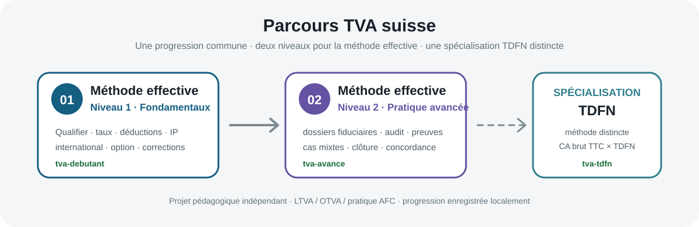

<div align="center">

# 🇨🇭 TVA suisse — méthode TDFN

### Entraînement pratique à la méthode des taux de la dette fiscale nette

Un parcours interactif en français pour **analyser, calculer et pratiquer la TVA suisse selon la méthode TDFN** à partir de situations proches du travail en fiduciaire.

[](https://mariialobur.github.io/tva-tdfn/)
[](https://mariialobur.github.io/tva-tdfn/)
[](https://mariialobur.github.io/tva-tdfn/)
[](https://mariialobur.github.io/tva-tdfn/)
[](https://mariialobur.github.io/tva-tdfn/)

### 👉 [Ouvrir la spécialisation TDFN](https://mariialobur.github.io/tva-tdfn/)

</div>

<p align="center">
  
</p>

> [!IMPORTANT]
> Ce projet est un **outil pédagogique indépendant**. Il n’est ni un service de l’Administration fédérale des contributions (AFC/ESTV), ni une formation accréditée, ni un conseil fiscal individualisé. Les textes légaux, publications et services officiels en vigueur restent déterminants.

---

## 🗺️ Une spécialisation dans un parcours TVA plus large

<p align="center">
  
</p>

La méthode TDFN constitue une **méthode de décompte distincte**. Elle complète les deux niveaux consacrés à la méthode effective sans constituer un «Niveau 3» de celle-ci.

- **01 · Méthode effective — Niveau 1** : fondamentaux et construction du décompte ;
- **02 · Méthode effective — Niveau 2** : dossiers fiduciaires avancés, contrôle et clôture ;
- **Spécialisation TDFN** : admissibilité, attribution des TDFN, plusieurs activités, international, changements de méthode et pratique fiduciaire.

---

## En un coup d’œil

| Élément | Contenu |
| --- | --- |
| **Parcours** | 44 cas : 43 étapes évaluées + 1 atelier libre |
| **Navigation** | Plan de spécialisation par modules + navigation cas par cas |
| **Progression** | `À faire` · `En cours` · `Acquis` · `Maîtrisé`, enregistrée localement |
| **Méthode de travail** | analyser → calculer → reporter → contrôler |
| **Pratique** | PME, fiduciaire, commerce, services, hôtellerie, garage, international… |
| **Références** | LTVA, OTVA, ordonnance AFC TDFN, Info TVA 12, publications AFC |
| **Évaluation finale** | **15 questions**, tirage aléatoire **équilibré par compétences**, seuil **12/15 (80 %)** |
| **Attestation** | document local en 2 pages : résultat + relevé détaillé du parcours |
| **QA** | smoke + unit + Playwright E2E + axe accessibility + références visuelles desktop/mobile |
| **Accès** | gratuit, sans inscription |

---

## Pourquoi ce projet ?

La méthode TDFN paraît simple lorsqu’elle est réduite à une formule : contre-prestations brutes, TVA comprise, multipliées par un taux. Les difficultés importantes apparaissent pourtant **avant et autour du calcul** : l’entreprise peut-elle utiliser la méthode ? Quel TDFN a réellement été attribué ? Plusieurs activités doivent-elles être séparées ? Comment appliquer la règle des 10 % ? Comment traiter une prestation étrangère, une rectification ou un changement de méthode ?

Le parcours cherche donc moins à faire mémoriser des pourcentages qu’à développer un réflexe de travail : **qualifier la situation, choisir la règle applicable, calculer, reporter puis contrôler**.

---

## ✨ Compétences travaillées

### `1` Fondamentaux TDFN

Le début du parcours installe les réflexes essentiels : distinction entre **taux légal facturé au client** et **TDFN utilisé avec l’AFC**, calcul sur le montant TTC, traitement forfaitaire de l’impôt préalable et lecture du décompte.

### `2` Admissibilité et limites

Des cas spécifiques obligent à examiner les conditions d’accès à la méthode, les limites quantitatives et les exclusions avant de sortir la calculatrice.

### `3` Plusieurs activités et attribution des TDFN

Le parcours travaille la règle des 10 %, les nouvelles activités, les entreprises déjà établies, plusieurs TDFN, les activités relevant d’un même taux et le traitement d’une activité dont le TDFN propre n’a pas été autorisé.

### `4` Travail fiduciaire et international

Les exercices abordent également les contre-prestations convenues ou reçues, les périodes de décompte, les opérations internationales, l’impôt sur les acquisitions, les déductions du chiffre d’affaires, les contrôles de cohérence et la préparation du décompte à partir d’informations client.

### `5` Rectifications et changements de méthode

Une partie avancée traite la rectification d’une période, la concordance annuelle et les passages **méthode effective ↔ TDFN**, avec les traitements de valeur résiduelle et les rubriques correspondantes.

### `6` Dossier final et atelier libre

Le parcours se termine par des situations de synthèse et un atelier libre permettant de tester un scénario plus autonome sans solution prédéfinie.

---

## 🧭 Plan de spécialisation

Avec 44 cas, une simple liste linéaire ne suffit plus. La version 18 ajoute un **Plan de spécialisation TDFN** accessible directement depuis la barre de navigation.

Le plan regroupe les cas en onze ensembles : admissibilité, compréhension de la méthode, plusieurs activités, règle des 10 %, international, travail fiduciaire, effective → TDFN, TDFN → effective, procédures particulières, dossier final et atelier libre.

Chaque carte affiche son état réel :

`À faire` · `En cours` · `Acquis ✓` · `Maîtrisé ✓`

Un clic ouvre directement le cas concerné. Sur mobile, le plan devient une vue plein écran afin d’éviter une liste difficile à parcourir.

---

## 📈 Progression : `Acquis` et `Maîtrisé`

Le parcours distingue deux niveaux de validation :

- **Acquis** : le cas a été réussi sans consultation de la solution ;
- **Maîtrisé** : le raisonnement a ensuite été revalidé dans une phase de validation sans exemple guidé.

La progression est enregistrée dans le navigateur. Elle peut être **exportée en JSON**, puis réimportée sur le même schéma de version afin de conserver une sauvegarde locale.

---

## 🧠 Évaluation finale structurée

L’évaluation finale ne repose plus sur quinze questions choisies aveuglément dans toute la banque. Le tirage reste aléatoire, mais suit un **blueprint thématique** afin que chaque tentative couvre réellement le parcours.

Les **15 questions** sont réparties entre six blocs :

| Bloc | Questions par tentative |
| --- | ---: |
| Principes & calcul | 3 |
| Admissibilité & administration | 2 |
| Activités multiples & règle des 10 % | 3 |
| Attribution des TDFN | 2 |
| International & opérations particulières | 2 |
| Changements de méthode & corrections | 3 |
| **Total** | **15** |

Le seuil de réussite est **12/15, soit 80 %**. L’ordre des questions et des réponses reste mélangé. Les solutions et sources n’apparaissent qu’après la remise de l’épreuve.

L’examen se débloque uniquement après validation des **43 étapes évaluées sans consultation de la solution**.

> [!NOTE]
> Cette auto-évaluation mesure la réussite dans le périmètre de ce projet. Elle ne constitue pas une certification professionnelle générale des compétences en TVA.

---

## 📄 Attestation de parcours

Après réussite de l’évaluation finale, une attestation en **deux pages** peut être préparée directement dans le navigateur.

**Page 1** reprend le nom indiqué par le participant, les 43 étapes acquises, le résultat de l’évaluation structurée, le pourcentage, la date et les thèmes principaux.

**Page 2** présente un relevé plus détaillé : fondamentaux, activités multiples, construction du décompte, international, travail fiduciaire, rectifications, changements de méthode et dossiers PME.

Le nom et le résultat restent locaux au navigateur. Aucun registre serveur d’attestations n’est tenu et l’identité n’est pas vérifiée.

> [!CAUTION]
> L’attestation confirme uniquement l’achèvement de ce parcours indépendant et la réussite de son auto-évaluation. Elle **ne constitue ni un diplôme, ni un titre professionnel, ni une certification reconnue ou accréditée**.

---

## 🖥️ Aperçus

### Parcours principal

<p align="center">
  
</p>

### Calcul et décompte

<p align="center">
  
</p>

### Atelier libre

<p align="center">
  
</p>

### Version mobile

<p align="center">
  
</p>

---

## 📚 Référentiel officiel

Le contenu s’appuie en priorité sur les sources officielles suisses :

- **LTVA — RS 641.20** ;
- **OTVA — RS 641.201** ;
- **ordonnance AFC sur la valeur des TDFN — RS 641.202.62** pour la valeur exacte des taux par activité ;
- **Info TVA 12 — Taux de la dette fiscale nette** ;
- publications AFC relatives à la réforme applicable depuis 2025 ;
- prototype du décompte TDFN ;
- informations AFC sur les changements de méthode, rectifications, concordance et Portail AFC.

Les références utiles sont reliées aux cas. Lorsqu’un exemple récapitulatif et une source normative détaillée divergent sur la valeur exacte d’un TDFN, le parcours privilégie la source normative applicable et invite à vérifier la pratique officielle en vigueur.

**Version du parcours : 18.0.0**  
**Dernière revue fonctionnelle / QA : 19.08.2026**  
**Revue fiscale principale conservée : 16–17.08.2026**

---

## 🧪 Qualité et tests

La version 18 renforce fortement le filet de sécurité technique :

- **smoke tests** : présence des fichiers critiques, syntaxe JavaScript et intégrité du release ;
- **unit tests** : 44 cas / 43 étapes évaluées, cohérence des sources, calculs ciblés, Plan et blueprint de l’examen ;
- **Playwright E2E** : navigation par le Plan, états de progression, gate de l’examen, épreuve 15 questions, export et import de progression ;
- **axe** : détection automatique des violations serious/critical sur l’espace de travail, le Plan, le mémo et l’examen final ;
- **visual references** : captures desktop et mobile conservées dans les artifacts du workflow afin de faciliter la détection des régressions visuelles.

Ces contrôles ne remplacent ni la revue fiscale humaine ni un audit WCAG complet, mais ils réduisent le risque de régressions silencieuses.

---

## 🔒 Données et confidentialité

Aucun compte n’est nécessaire. La progression, le résultat d’examen et le nom utilisé pour l’attestation restent dans le navigateur. L’export de progression crée un fichier JSON local ; l’import demande confirmation avant de remplacer l’état courant.

Une réinitialisation complète efface également le résultat de l’évaluation finale structurée afin qu’une ancienne attestation ne puisse pas rester associée à un parcours remis à zéro.

---

## ⚠️ Limites

Le projet est un **environnement d’entraînement**, pas un moteur de décision fiscale automatisé. Il ne peut pas confirmer l’admissibilité d’une entreprise réelle, attribuer un TDFN à la place de l’AFC, vérifier la valeur probante de documents réels ou garantir qu’une règle n’a pas évolué après la dernière revue.

Les entreprises, montants et scénarios sont pédagogiques. Pour un dossier réel, la législation et la pratique officielle en vigueur priment toujours.

---

## 🧩 Architecture principale

```text
tva-tdfn/
├── index.html
├── app.js
├── data.js
├── logic.js
├── store.js
├── components.js
├── pedagogy.js
├── transition.js
├── tdfn-plan.js
├── tdfn-plan.css
├── tdfn-final-v4.js
├── evaluation.css
├── styles.css
├── tests/
│   ├── unit.mjs
│   ├── e2e.spec.mjs
│   ├── accessibility.spec.mjs
│   └── visual.spec.mjs
└── .github/workflows/quality.yml
```

Le dépôt contient encore quelques scripts historiques de migration / application des anciennes versions. Ils sont conservés pour l’instant comme historique technique mais ne constituent plus le cœur du parcours actuel.

---

## 🚀 Utiliser le projet

### Version en ligne

### 👉 [mariialobur.github.io/tva-tdfn](https://mariialobur.github.io/tva-tdfn/)

### Copie locale

```bash
git clone https://github.com/mariialobur/tva-tdfn.git
cd tva-tdfn
npm install
npm test
```

Pour ouvrir l’application localement :

```bash
python -m http.server 8000
```

puis `http://localhost:8000`.

---

## 🔗 Les trois entraînements

**[01 · Méthode effective — Niveau 1](https://mariialobur.github.io/tva-debutant/)**  
Fondamentaux, 18 cas, qualification, décompte, international, impôt préalable et corrections.

**[02 · Méthode effective — Niveau 2](https://mariialobur.github.io/tva-avance/)**  
18 dossiers avancés : grand livre, audit, immobilier, acquisitions, contrôles et clôture.

**[Spécialisation · TDFN](https://mariialobur.github.io/tva-tdfn/)**  
44 cas : admissibilité, plusieurs activités, attribution des TDFN, pratique fiduciaire et changements de méthode.

---

## 👤 Projet

**Conception : Mariia Lobur**  
[LinkedIn](https://www.linkedin.com/in/mariia-lobur/)

Projet pédagogique indépendant développé à des fins d’entraînement et de révision de la TVA suisse.

---

<div align="center">

### Qualifier · calculer · contrôler · recommencer

**[Ouvrir la spécialisation TDFN](https://mariialobur.github.io/tva-tdfn/)**

</div>
